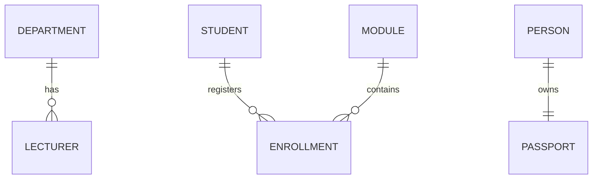

# 04. Keys and Relationships

## Learning Outcomes

After this lesson, you should be able to:

- Explain primary key and foreign key.
- Model one-to-one, one-to-many, and many-to-many relationships.
- Build relationship tables in SQL.

---

## 1. Primary Key

### Definition

A primary key is a column (or set of columns) that uniquely identifies each row.

### Plain-language meaning

It is the "ID card number" of each row.

Rules:

- Must be unique
- Must not be `NULL`
- One primary key per table

Example:

```sql
CREATE TABLE person (
  person_id INT PRIMARY KEY,
  name VARCHAR(50) NOT NULL
);
```

---

## 2. Foreign Key

### Definition

A foreign key is a column that references a primary key in another table.

### Plain-language meaning

A foreign key is how one table says, "I am linked to that row over there."

Example:

```sql
CREATE TABLE passport (
  passport_id INT PRIMARY KEY,
  person_id INT UNIQUE,
  FOREIGN KEY (person_id) REFERENCES person(person_id)
);
```

---

## 3. Relationship Types

## 3.1 One-to-One (1:1)

Meaning:

- One row in Table A relates to one row in Table B.
- Common when splitting sensitive or optional data.

Example:

- One person has one passport.
- One passport belongs to one person.

SQL pattern:

- Use foreign key + `UNIQUE` on related column.

## 3.2 One-to-Many (1:N)

Meaning:

- One row in A relates to many rows in B.
- Each row in B relates to one row in A.

Example:

- One department has many lecturers.
- Each lecturer belongs to one department.

```sql
CREATE TABLE department (
  department_id INT PRIMARY KEY,
  name VARCHAR(50) NOT NULL
);

CREATE TABLE lecturer (
  lecturer_id INT PRIMARY KEY,
  name VARCHAR(50) NOT NULL,
  department_id INT,
  FOREIGN KEY (department_id) REFERENCES department(department_id)
);
```

> [!IMPORTANT]
> The foreign key goes on the "many" side.

## 3.3 Many-to-Many (N:N)

Meaning:

- Many rows in A relate to many rows in B.
- Requires a third table (junction/link table).

Example:

- A student can take many modules.
- A module can have many students.

```sql
CREATE TABLE student (
  student_id INT PRIMARY KEY,
  name VARCHAR(60) NOT NULL
);

CREATE TABLE module (
  module_id INT PRIMARY KEY,
  name VARCHAR(60) NOT NULL
);

CREATE TABLE enrollment (
  enrollment_id INT PRIMARY KEY,
  student_id INT NOT NULL,
  module_id INT NOT NULL,
  FOREIGN KEY (student_id) REFERENCES student(student_id),
  FOREIGN KEY (module_id) REFERENCES module(module_id)
);
```

---

## ER View (Conceptual)



---

## Common Mistakes

- Creating related tables without foreign keys
- Placing foreign key on wrong side in 1:N
- Trying to store N:N directly without junction table
- Using natural values (like name) as keys when they can change

---

## Remember

> [!TIP]
> Primary key identifies. Foreign key connects.

> [!TIP]
> N:N always needs a third table.

---

## Checkpoint Questions

1. Why must `person_id` be `UNIQUE` in a 1:1 passport table?
2. In 1:N, which side stores the foreign key?
3. Why is an `enrollment` table needed for student-module relationship?

